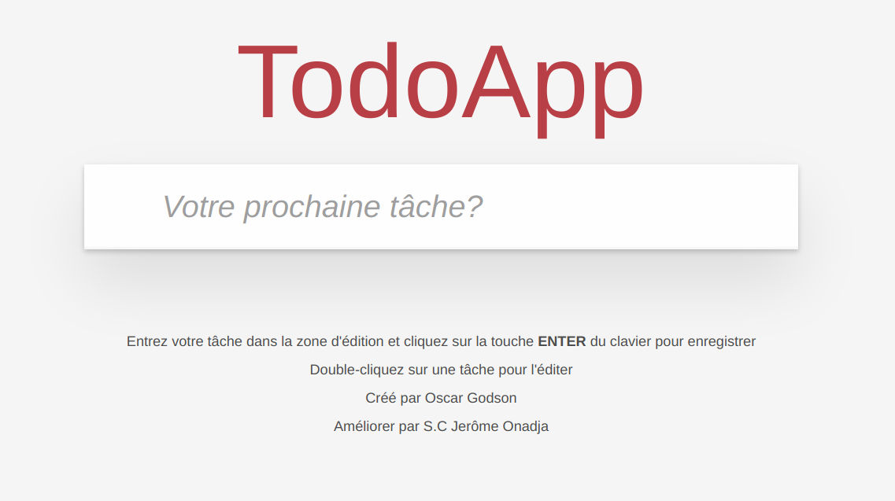

# Projet 8 : [Reprenez et améliorez un projet existant](https://openclassrooms.com/projects/reprenez-et-ameliorez-un-projet-existant)

Amélioration d'un projet existant de todo-list en vanillaJS.

Le projet comporte quelques bugs à __identifier et corriger__, quelques __optimisations__ possibles à intégrer.

Les tests unitaires sont à améliorer en utilisant le framework __Jasmine__.

Un audit de performance est attendu sur un site concurrent à notre application, la mise en évidence de certaines fonctionnalités intéressantes est attendue.

Enfin une documentation utilisateur ainsi qu'une documentation technique sont attendues.




Recap des  [__fichiers et fonctions__](./livrable/function_recap.pdf) de notre appli

## _Etape 1 : Corrigez les bugs_

#### 1. bug 1 : faute de frappe dans [__controller.js__](./js/controller.js)

Controller.prototype.__addItem__ à la place de Controller.prototype.__adddItem__ 
```js
	Controller.prototype.addItem = function (title) {
		var self = this;

		if (title.trim() === '') {
			return;
		}

		self.model.create(title, function () {
			self.view.render('clearNewTodo');
			self._filter(true);
		});
	};
```

#### 2. bug 2 : création des ID dans [__store.js__](./js/store.js)

Store.prototype.save

> La méthode [Date.now()](https://developer.mozilla.org/fr/docs/Web/JavaScript/Reference/Objets_globaux/Date/now) est parfaitement adaptée. La fonction retourne un chiffre unique correspondant au nombre de millisecondes écoulées depuis le 1er Janvier 1970 00:00:00. 

> Il s' agit donc de notre __identifiant unique__.
```js
	Store.prototype.save = function (updateData, callback, id) {
        	var data = JSON.parse(localStorage[this._dbName]);
        	var todos = data.todos;

        	callback = callback || function () {};

		/**
		 * Si un ID a été donné, trouve l'élément et met à jour les propriétés
		 * @param  {number} (id) L' ID de l' élément.
		 */
		if (id) {
			for (var i = 0; i < todos.length; i++) {
		  		if (todos[i].id === id) {
		    		for (var key in updateData) {
	      			todos[i][key] = updateData[key];
		    		}
		    		break;
		  		}
			}
			localStorage[this._dbName] = JSON.stringify(data);
			callback.call(this, todos);
		} else {
  			/**
			 * Génére un identifiant unique
			 * @see  https://developer.mozilla.org/fr/docs/Web/JavaScript/Reference/Objets_globaux/Date/now
			 * @example
			 * returns {number} 1519326977765
			 */
			updateData.id = Date.now();
			console.log('id create : ' + updateData.id);
			todos.push(updateData);
			localStorage[this._dbName] = JSON.stringify(data);
			callback.call(this, [updateData]);
		}
    };
```

#### 3. amélioration : [__controller.js__](./js/controller.js)

Controller.prototype.removeItem => la boucle forEach est inadaptée.

> Cette instrustion est inadaptée et n'a aucun sens
```js
    var items;
   	self.model.read(function(data) {
   		items = data;
   	});
``` 	

> En optimisant le mieux possible nous obtenons une fonction plus performante
```js
	Controller.prototype.removeItem = function (id) {
		var self = this;
		self.model.remove(id, function () {
			self.view.render('removeItem', id);
		});

		self._filter();
	};
```


#### 3. amélioration : [__store.js__](./js/store.js)

Store.prototype.save => les deux boucles peuvent être remplacées par des fonctions natives

> Par exemple on peut remplacer ces boucles: 
```js
    for (var i = 0; i < todos.length; i++) {
   	    if (todos[i].id === id) {
   		    for (var key in updateData) {
   	      		todos[i][key] = updateData[key];
   		    }
   		    break;
   	    }
    }
```   
 
> par ses lignes ci-dessous:
```js
    let todoIndex = todos.findIndex(function (todo) {
    	return todo.id === id
    })
    if (-1 !== todoIndex){
    	todos[todoIndex] = Object.assign(todos[todoIndex], updateData)
    }
```

#### 3. amélioration : [__store.js__](./js/store.js)

Store.prototype.remove => les deux boucles peuvent être remplacées par des fonctions natives

> Par exemple on peut remplacer ces boucles: 
```js
    for (var i = 0; i < todos.length; i++) {
   		if (todos[i].id == id) {
   			todoId = todos[i].id;
   		}
   	}
   
   	for (var i = 0; i < todos.length; i++) {
   		if (todos[i].id == todoId) {
   			todos.splice(i, 1);
   		}
   	}
```	
> par ses lignes ci-dessous:
```js
    let todoIndex = todos.findIndex(function (todo) {
    	return todo.id === id
    })
    if (-1 !== todoIndex){
    	todos.splice(todoIndex, 1)
    }
```

## _Etape 2 : où sont les tests ?!_

Tests unitaires avec le framework[ __Jasmine__](https://github.com/jasmine/)

Pré-requis : 
* installer [NPM et NodeJs](https://www.npmjs.com/get-npm?utm_source=house&utm_medium=homepage&utm_campaign=free%20orgs&utm_term=Install%20npm)
* installer [ __Jasmine__](https://github.com/jasmine/jasmine/releases)

Télécharger [le dossier](https://github.com/Gu1ll0m/projet8_todolist.git) puis ouvrir dans votre navigateur le fichier __SpecRunner.html__ que vous trouverez en suivant le chemin suivant `../P8/test/SpecRunner.html`

Pour voir plus en détails les tests aller dans le fichier [__ControllerSpec.js__](./test/ControllerSpec.js)

#### Récap des tests effectués :

> 1. #62 => test si on affiche bien model et view
> 2. #92 => test la view quand on affiche les todos de l'onglet active
> 3. #114 => test la view quand on affiche les todos de l'onglet completed
> 4. #179 => test la view si "All" est surligné quand on a l' onglet par défaut
> 5. #188 => test la view si "Active" est surligné quand on change pour l'onglet active
> 6. #198 => test le model quand on bascule tous les états des todos vers terminé
> 7. #213 => test la mise à jour de view
> 8. #232=> test le model en cas d' ajout d'un todo
> 9. #281 => test le model si on supprime un todo

#### Tests suivants ajoutés :

> 1. #103 => test le model quand on affiche les todos de l'onglet active
```js
	it('should show active entries to the model (NEW TEST)', function () {
		// test le model
		var todo = {title: 'my todo', completed: false};
		setUpModel([todo]);

		subject.setView('#/active');

		expect(model.read).toHaveBeenCalledWith({completed: false}, jasmine.any(Function));
	});
```
	
> 2. #125 => test le model quand on affiche les todos de l'onglet completed
```js
    it('should show completed entries to the model (NEW TEST)', function () {
		// test le model
		var todo = {title: 'my todo', completed: true};
		setUpModel([todo]);

		subject.setView('#/completed');

		expect(model.read).toHaveBeenCalledWith({completed: true}, jasmine.any(Function));
	})
```

## _Etape 3 : optimisez la performance du site [todolistme.net](http://todolistme.net/)_


## _Etape 4 : améliorez le projet_

Ouvrir la _documentation utilisateur_ dans votre navigateur : [__documentation utilisateur__](./livrable/doc_utilisateur/doc_utilisateur.md)


