# Audit de performance du site
## http://todolistme.net/

### 1- Résumé du fonctionnement de l’ application

Notre concurrent propose une application de todo-list perfectible.
Cette application permet de faire plusieurs choses :
1. créer des catégories de liste de tâches à effectuer
2. créer des liste de tâches à effectuer, les enregistrer, éditer, effacer
3. donner une temporalité

Via Wappalyzer nous voyons la présence des éléments suivants sur le site :

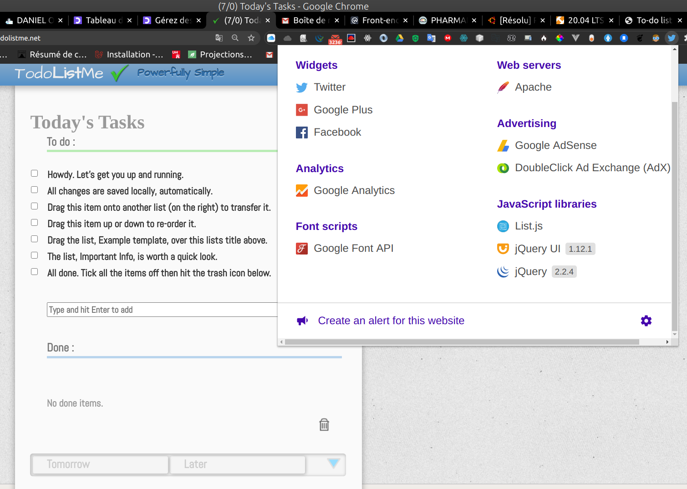

### 2- Utilisation des outils du navigateur Chrome
L’ audit à été réalisé avec les outils fournis par
notre navigateur. Il s'agit du navigateur Chrome Version 84.0.4147.89 (Build officiel) (64 bits) de Google.

#### 2-1- Outil « network »

L’ affichage complet de la page du concurent prend 5,27 secs.

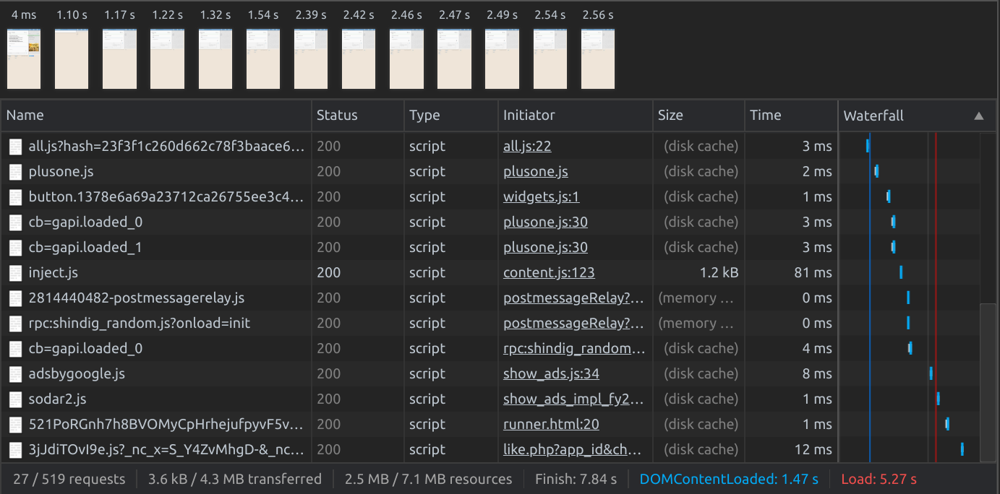

L’ affichage complet du notre prend 103ms.
On peut dire que nous avons une longueur d'avance sur notre concurent.

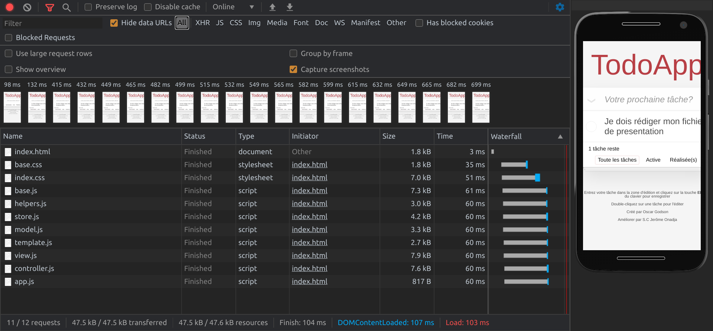

Cette différence de temps de chargement s'explique par le fait que le site du concurent utilise beaucoup
d'images.

Pour l'audit du coverage, c'est-à-dire le code utilisé et non utilisé, nous remarquons que nous avons une
longueur d'avance encore sur notre concurent. 
En effet le site du concurent utilise que 41% du code de son application.

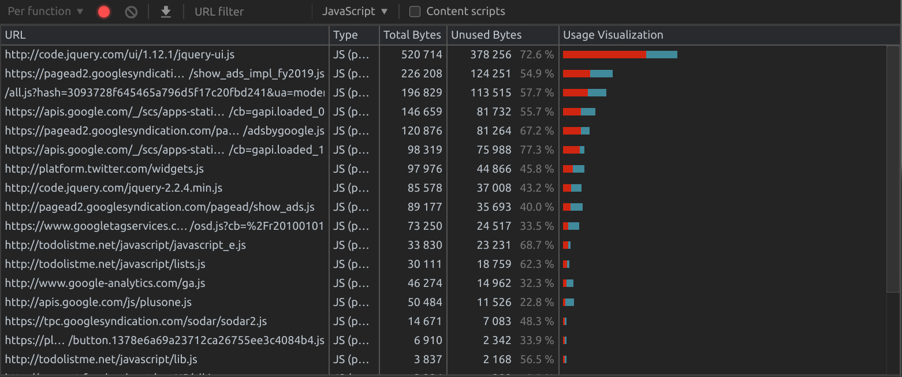

Nous remarquons que le notre utilise jusqu'à 63% de son code,

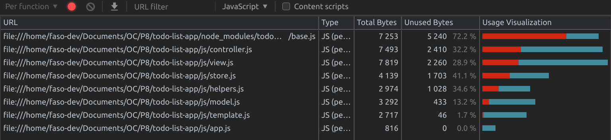

ce qui est quand même à féliciter. 
Cependant vu les fonctionalités limitées de notre application,
nous sommes appelés à mieux faire que ça, 
c'est-à-dire avoir un taux de coverage de 95%.
Cela peut se faire en éliminant le code non utilisé dans le fichier base.js qui represente les 20% du
code global no utilisé.

En ce qui concerne le concurent, il peut mieux faire en supprimant complètement l'usage de jQuery dans le projet.
Du point de vue coverage, on s'apperçoit que jusqu'à 43% de jQuery n'est pas utilisé, ce qui est domage.

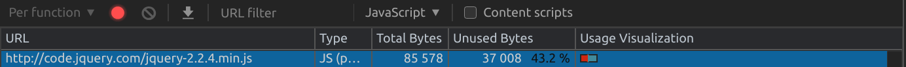

Pareil pour jQuery-ui qui n'a même pas 30% d'usage.

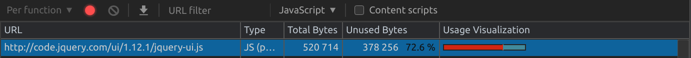

#### 2-2- Outil « audit »
4 Catégories :
* Performance
* Accessibilité
* Bonnes pratiques

##### 2-2-2- Performance

33% de test validé, application trop lente.

Les PNG peuvent être amélioré (SVG, background repeat) 
tout comme certains fichier JS (utilisation de jquery).

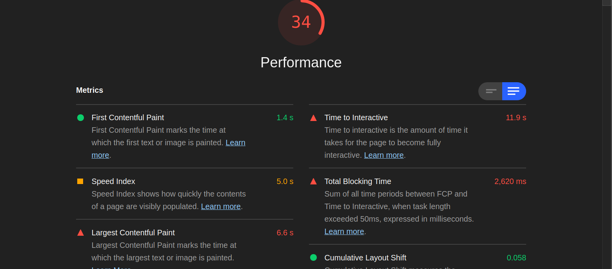

##### 2-2-3- Accessibilité

59% de réussite, quelques points d’ amélioration comme:
* ajouter un attribut alt pour les images et pour les iframes
* accentuer plus les contrastes
* ajouter un attribut lang dans le HTML

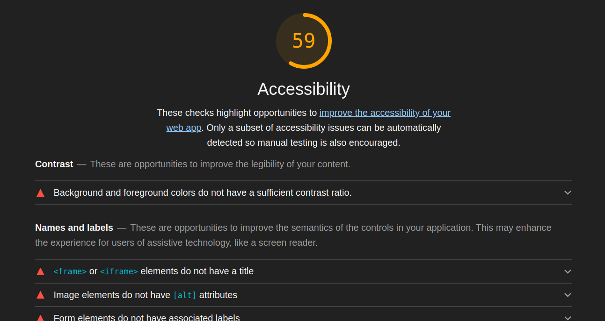

##### 2-2-4- Bonnes pratiques

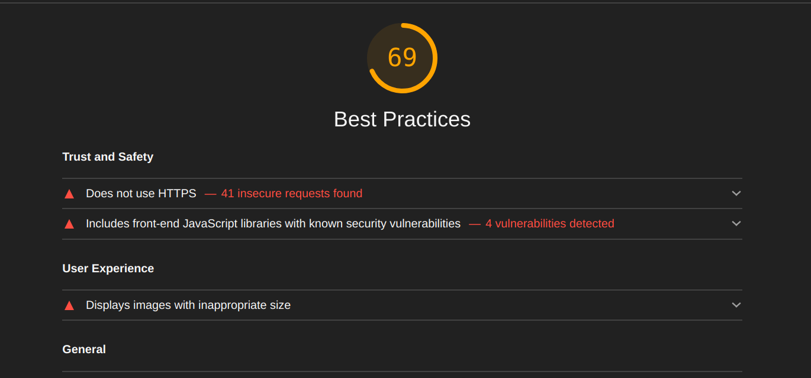

Recommandations pour améliorer les performances et moderniser l’ application.

56 %, grosse marge de progression ici également.
* pas de HTTPS
* 2 failles de sécurités dans les librairies front utilisés
* présences de deux erreurs dans la console

### 3- Comparaison avec notre application

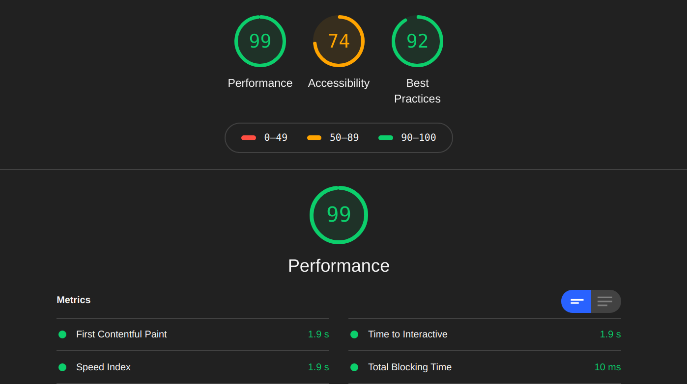

#### 3-2. Performance 

Comparativement à la notre qui obtient une note de 99%, nous pouvons dire que sommes bien
partis pour garder nos utilisateurs

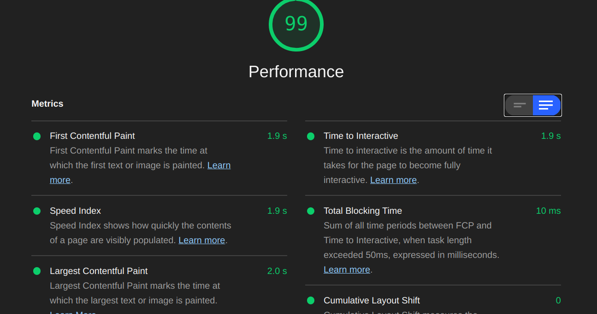

#### 3-3. Bonnes pratiques 
12 tests passés sur 12, ce qui témoigne la bonne organisation et structuration de notre code.
Il reste quelques améliorations à faire, notamment supprimer les affichages inutiles dans la console

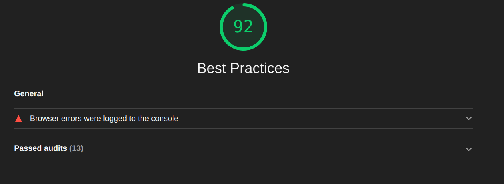

#### 3-4. Accessibilité

Encore une fois, nous obenons une très bonne note comparée à notre concurent, 74% contre 59%

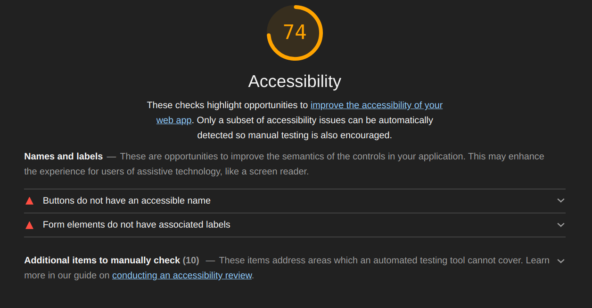

Comme axe d'amélioration, nous pouvons ajouter : 
* un label: `input class="new-todo" placeholder="What needs to be done?" autofocus`

### 4- Scalling :
Fonctionnalité que l’on pourrait éventuellement intégré à notre application :
* temporalité
* catégories de liste
* La persistance dans une base de donnée des tâches
* La personalisation des profiles afin de mieux gérer les tâches
* Permettre le partage des tâches entre utilisateur
* Ajouter une otpion pour rechercher une tâche
* Ne plus autoriser l'édition des tâches complétées
* Permettre d'attribuer le temps qu'il faut pour réaliser une tâche
* Ajouter une option de priorité pour les tâches

### 5- Résumé
##### Application de notre concurrent :
1. Lente, pas optimisée
2. Accessibilité moins bonne
3. Design discutable, quelques fonctionnalités intéressantes

##### Notre application :
1. Rapide, optimisé et performante
3. Bonne accessibilité, amélioration via `label` et contrastes pour que ce soit parfait
4. La catégorisation des listes
5. La persistance dans une base de donnée des tâches
6. La personalisation des profiles afin de mieux gérer les tâches
7. Permettre le partage des tâches entre utilisateur
8. Ajouter une otpion pour rechercher une tâche
9. Ne plus autoriser l'édition des tâches complétées
10. Permettre d'attribuer le temps qu'il faut pour réaliser une tâche
11. Ajouter une option de priorité pour les tâches

