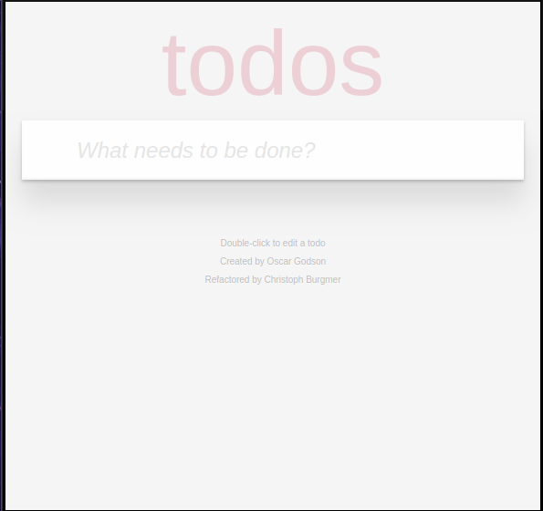
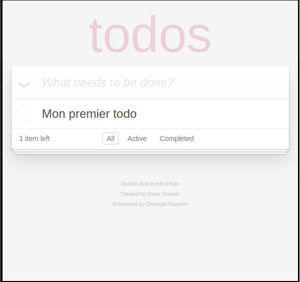
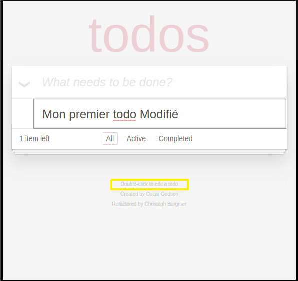
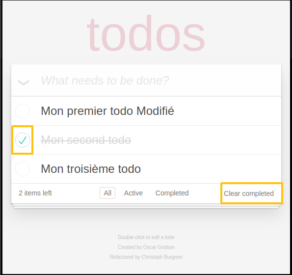
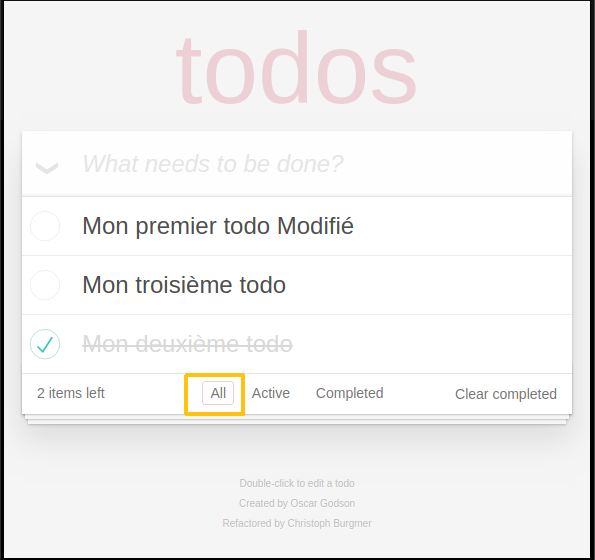
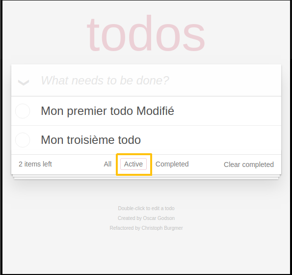
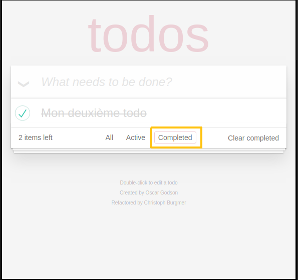
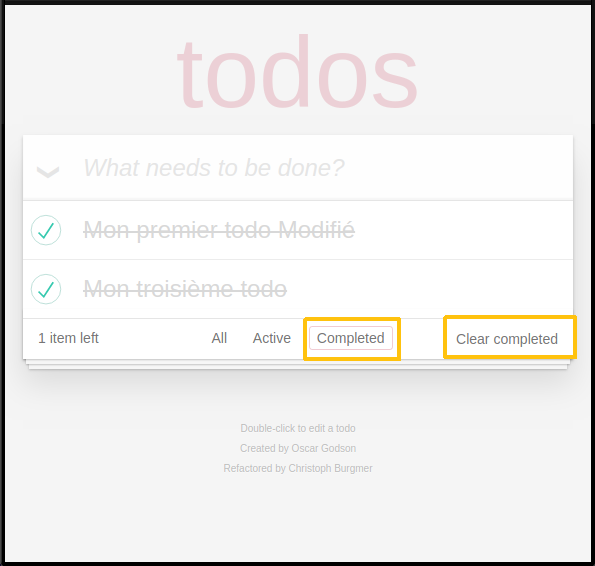
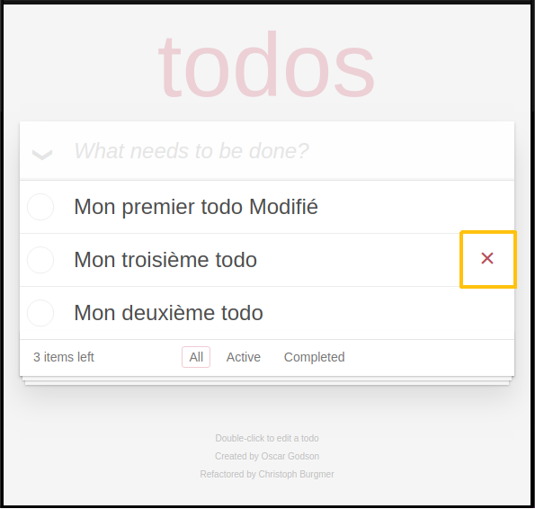

# Documentation utilisateur de notre application Todos

Notre application a pour objectif de vous permettre très facilement de créer des todos-list.

Pour ce faire nous avons élaboré des fonctions permettant de créer, de modifier ou supprimer des éléments.

Notre application doit être utilisable par tous, de 7 à 77 ans, sur tout type de support (ordinateur, tablette, smartphone,…).

Nous vous proposons donc de voir comment réaliser les actions suivantes :
1. créer un todo
2. modifier un todo
3. modifier l’ état d’ avancement d’un todo
4. voir l’état de nos todos
5. supprimer un ou plusieurs  todos

## 1. Créer un Todo

Notre application se présente de la façon suivante.

Pour créer un Todo cliquer dans « what needs to be done ? » et rédiger votre todo.

Appuyer sur _entrée_ pour enregistrer le todo.

Vous avez créé votre premier todo.

Votre todo apparaît dans la liste des todos.

Plusieurs éléments sont apparus :
+ un icône à gauche de « what needs to be done ? »
+ une indication du nombre de todos, ici _1 item left_
+ un onglet __all__
+ un onglet __active__
+ un onglet __completed__

Voyons maintenant comment modifier un todo.

## 2. Modifier un Todo

Afin d’ avoir l’ application la plus simple à utiliser nous avons choisit de permettre l’ édition tout simplement en double cliquant dans le todo à modifier directement.

Taper sur _Entrée_ pour valider la modification ou sur _échap_ pour l' annuler.

Le todo que vous modifiez est encadré.

Voyons  maintenant comment modifier l’ état d’ avancement d’un todo.

## 3. Modifier l’ état d’ avancement d’un todo

Nous avons créé 3 todos, notre second todo est terminé.

Pour signifier que votre todo est terminé il suffit de cliquer dans le cercle à gauche du todo.

Une fois fait le todo est barré et un bouton __Clear completed__ apparaît en bas à droite. 

Ce bouton sert à effacer le todo que l’on a indiqué comme terminé.

## 4. Voir l’état de nos todos

1. 

Le bouton __All__ nous montre l’ ensemble des Todos quelques soit leur état.

2. 

Le bouton __Active__ nous montre les Todos en cours.

3. 

Le bouton __Completed__ quand à lui nous montre les todos que nous avons terminé.

## 5. Supprimer un ou plusieurs todos

Pour supprimer définitivement nos todos terminés, ceux que l’on retrouve dans l’onglet __Completed__, il suffit de cliquer sur le bouton __clear completed__ .

Cette action effacera définitivement les todos en question.

Nous pouvons supprimer directement les todos un par un à la volée sans passer par l’onglet __Completed__. 

Pour se faire lorsque l’on survole un todo avec notre souris une croix à droite apparaît.

Cliquer sur la croix supprime définitivement le todo en question. 

Pas de retour en arrière possible.

