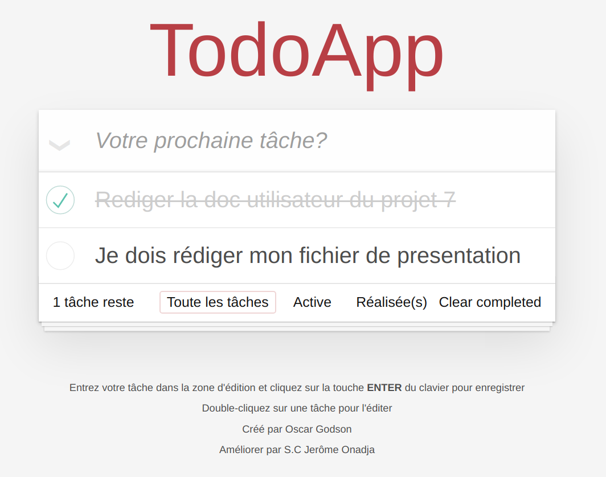

# Documentation utilisateur de notre application TodoApp

Se rappeler des tâches que l’on doit faire pour sa journée de demain est toujours une casse tête pour chacun de nous. 

Il devient alors impérativement nécessaire pour nous d’avoir un support sur lequel nous pouvons lister l’ensemble de nos activités ou tâches à faire pour la prochaine journée.
 
C’est dans ce contexte que nous avons mis à votre disposition un support numérique appelé TodoApp, vous permettant de retrouver en un temps record la prochaine tâche ou activité que vous devez réaliser. 

Ci-dessous, notre guide utilisateur pour vous aider à prendre en main notre application.
1. Créer une tâche
2. Modifier une tâche
3. Modifier l’ état d’ avancement d’une tâche
4. Voir l’état de vos tâches
5. Supprimer une ou plusieurs  tâches

Trève de bavardage, prenez en main dès maintenant TodoApp :

## 1. Créer une tâche

L’interface de notre application ressemble à ceci lors du premier lancement.

Pour créer une tâche cliquer dans « Votre prochaine tâche ? » et rédiger votre tâche.

Appuyer sur la touche _ENTER_ du clavier pour enregistrer la tâche.

Vous avez créé votre première tâche.

Votre taĉhe apparaît dans la liste des tâches.

Plusieurs éléments sont apparus :
+ un icône à gauche de « Votre prochaine tâche ? »
+ une indication du nombre de todos, ici __1 tâche reste__
+ un onglet __Toute les tâches__
+ un onglet __Active__
+ un onglet __Réalisée(s)__

Voyons maintenant comment modifier une tâche.

## 2. Modifier une tâche

Un double clique sur une tâche suffit à activer le mode édition sur celle-ci afin de pourvoir la modifier directement.

Taper sur la touche __ENTER__ du clavier pour valider la modification ou sur la touche __ESC__ du clavier pour l' annuler.

Voyons  maintenant comment modifier l’ état d’ avancement d’un todo.

## 3. Modifier l’ état d’ avancement d’une tâche

Pour signifier q'une tâche est terminée, il suffit de cliquer dans le cercle à gauche de la tâche.

Une fois fait, la tâche est barrée et un bouton __Clear completed__ apparaît en bas à droite. 

Ce bouton sert à effacer les tâches que l’on a indiqué comme terminée.

## 4. Voir l’état de nos todos

1. 

Le bouton __Toutes les tâches__ nous montre l’ ensemble des tâches quelques soit leur état.

2. 

Le bouton __Active__ nous montre les tâches en cours.

3. 

Le bouton __Réalisée(s)__ quand à lui nous montre les tâches que nous avons terminée.

## 5. Supprimer un ou plusieurs todos

Pour supprimer définitivement nos tâches réalisées, il suffit de cliquer sur le bouton __clear completed__ .

Cette action effacera définitivement les tâches réalisées.

Nous pouvons supprimer directement les tâches une par une sans passer par le bouton __clear completed__. 

Pour se faire lorsque l’on survole une tâche avec notre souris, une croix à droite apparaît.

Un clique sur la croix supprime définitivement la tâche en question. 

Cette action est irréverssible.

